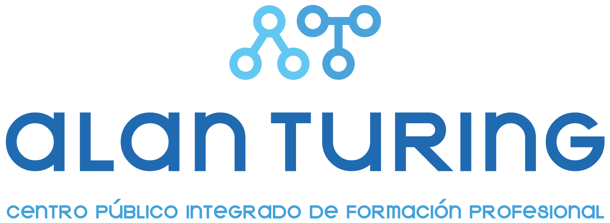

# 📄 Presentación Formación Dual – Cristina Fernández
---

## 👩‍💻 Alumna

- **Nombre:** Cristina Fernández Fernández  
- **Curso:** 1º DAW – Tarde  
- **Centro Educativo:** CPIFP Alan Turing
- **Empresa:** VIEWNEXT  
- **Ubicación:** Málaga  
- **Periodo:** Abril - Mayo 2025  

---

## 📁 Presentaciones

- [`presentacion_comun`](https://www.canva.com/design/DAGn9kcxgtg/dGrGwVueLEWerYawlSBh4g/edit?utm_content=DAGn9kcxgtg&utm_campaign=designshare&utm_medium=link2&utm_source=sharebutton) → Presentación común de la empresa  
- [`presentacion_individual`](https://www.canva.com/design/DAGmqUqxlvc/hEYAghyLjLwrTqjmXyiAYw/edit?utm_content=DAGmqUqxlvc&utm_campaign=designshare&utm_medium=link2&utm_source=sharebutton) → Presentación individual 

---

## 📋 Contenido de la presentación

- Introducción a la empresa VIEWNEXT  
- Tareas realizadas por semanas (7 semanas en total)  
- Herramientas utilizadas  
- Conocimientos adquiridos por módulo profesional  
- Valoración personal de la experiencia  

---

  

